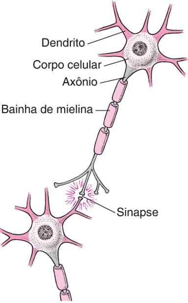
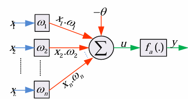
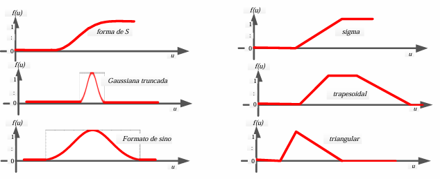

# Redes Neurais Artificiais 
## Sumário

1. [Objetivo](#objetivo)
2. [Estrutura artificial é baseada no neurônio biológico](#2-estrutura-artificial-é-baseada-no-neurônio-biológico)
3. [Estrutura artificial no contexto computacional](#3-estrutura-artificial-no-contexto-computacional)
4. [Tipos de função de ativação](#4-tipos-de-função-de-ativação)
5. [Características formais de 2 neurônios artificiais: Perceptron e Adaline](#5-características-formais-de-2-neurônios-artificiais-perceptron-e-adaline)
6. [Avaliação](#6-avaliação)
7. [Bibliotecas](#7-bibliotecas)

## 1. Objetivo
Este material descreve o desenvolvimento e a lógica de operação de Redes Neurais Artificiais aplicadas como classificadores supervisionados. O foco reside na compreensão matemática de como atributos de entrada são processados através de pesos e bias para posicionar e moldar hiperplanos de decisão em um espaço multidimensional. Através da análise dos modelos Perceptron e Adaline, detalham-se os mecanismos de aprendizado baseados na minimização do erro médio quadrático e na atualização iterativa de pesos, visando a otimização da acurácia e a capacidade de generalização da rede em tarefas de classificação linear.
## 2. Estrutura artificial é baseada no neurônio biológico
### 2.1) Neurônio biológico
* **Dendritos:** recebem os estímulos químicos (neurotransmissores) através das fendas sinápticas.

* **Corpo celular:** processa esses estímulos.

* **Axônio:** ativa e modula o impulso neuronal para a saída.

* **Sinapse:** ponto de transmissão do impulso entre os neurônios.




### 2.2) Neurônio artificial

* **Sinais de entrada ($x_n$):** representam os atributos ou estímulos recebidos. Os números de entradas nos dá a dimensão do espaço de atributos.
* **Pesos sinápticos ($\omega_n$):** responsável por ponderar a contribuição de cada entrada. Definem a **inclinação do hiperplano** de separação.
* **Junção sumadora  ($\Sigma$):** combina as entradas multiplicadas pelos pesos ($x \cdot \omega$).
* **Bias ou limiar ($\theta$):** funciona como o gatilho da ativação e desloca o hiperplano no espaço de atributos.
* **Potencial de Ativação ($u$):** resultado da soma das entradas ponderadas menos o bias:

$$u = \sum_{i=1}^{n} x_i \cdot \omega_i - \theta$$

* **Função de ativação  ($f_a(.)$):** modula o sinal para gerar a saída ($y$).

Estrutura:





## 3. Estrutura artificial no contexto computacional 
A rede neural artificial é definida aqui como um classificador de aprendizado supervisionado.


Na imagem observa-se pontos pretos e vermelhos.
* **Espaço de atributos:** eixo horizontal representa atributo 1 ($x_1$) e eixo vertical atributo 2 ($x_2$).
* **Hiperplano:** no gráfico é caracterizado pela linha verde. Representa a fronteira de decisão. O objetivo do neurônio é encontrar a posição exata dessa linha para separar os pontos vermelhos dos pretos da melhor forma possível.
* **Posicionamento:** durante o treinamento, a rede ajusta a inclinação e o deslocamento dessa linha.
## 4. Tipos de função de ativação
A função deve ser escolhida para melhorar a separação entre as classes no espaço de atributos. 



## 5. Características formais de 2 neurônios artificiais: Perceptron e Adaline
### 5.1) Modelo Perceptron 
Forma mais clássica e simples de um neurônio artificial. Ele foi projetado para resolver problemas de **classificação linear**.
#### 1. Funcionamento
O Perceptron recebe entradas, aplica pesos, soma tudo, subtrai um limiar (bias) e passa o resultado por uma função específica.
* **Entradas ($x$):** Podem ser valores binários $\{0, 1\}$ ou valores reais.
* **Saída ($y$):** É estritamente binária ou booleana (geralmente $\{0, 1\}$). Isso significa que ele classifica um dado em apenas duas categorias (Ex: "É spam" ou "Não é spam").
#### 2. Função de Ativação: Degrau
O Perceptron utiliza a **função degrau** para decidir a saída.

Se o resultado da energia for maior ou igual a zero, a saída é 1. Se for menor que zero, a saída é 0.
#### 3. Hiperplano
O Perceptron tenta desenhar uma linha reta (em 2D) ou um plano (em 3D) para separar os pontos de uma classe dos pontos da outra classe.

### 5.2) Modelo Adaline
O modelo Adaline é uma evolução do Perceptron, focado em saídas lineares e na minimização do erro médio quadrático para problemas de classificação e estimativa.
#### 1. Funcionamento e Estrutura
O Adaline processa as entradas e busca um hiperplano que represente a melhor separação dos dados.
* **Entradas($x$):** Podem ser valores lineares dentro do intervalo $\{-1 \le x \le 1\}$.
* **Saída  ($y$):** é linear, pertencente ao conjunto dos números reais ($y \in R^n$), geralmente graduada entre $-1$ e $1$.
* **Função de ativação é linear:** ou seja, a saída é igual o potencial de ativação ($f(u) = u$).
#### 2. Treinamento e Aprendizado 
O erro relacionado a saída obtida ($y$) e a saída desejada ($y_d$) é computado, e os valores dos pesos e bias são alterados até que **o erro de saída seja mínimo**.

Tem-se dois tipos de erros:
* **Erro Individual:** cálculo realizado para cada indivíduo. 

$$e^{i} = y^{i} - y_{d}^{i}$$

* **Erro Médio Quadrático:** representa a média aritmética dos quadrados dos erros de todas as amostras do conjunto de treinamento: 

$$e_{qm} = \frac{\sum_{i=1}^{P}(y^{i} - y_{d}^{i})^{2}}{P}$$

#### 3.   Regra de atualização dos pesos
$\omega(n+1) = \omega(n) + \eta ex$

* $\omega(n+1)$: novo peso
* $\omega(n)$: peso atual
* $\eta$ (Eta): taxa de aprendizado. Ela controla o quão grande será o ajuste.
* $e$: erro calculado ($e = y - y_d$)
* $x$: sinal de entrada
 
## 6. Avaliação
* O propósito central é **avaliar a acurácia.**
* É nesta fase que confirmamos se os pesos ($\omega$) e o bias ($\theta$) ajustados durante o treinamento são capazes de generalizar o conhecimento.
#### Avaliar a acurácia
O total da amostra é dividido em dois grupos distintos:
* **Amostra para treinamento:** conjunto utilizado para a rede aprender e ajustar seus parâmetros através de regra de aprendizado $\omega(n+1) = \omega(n) + \eta ex$.
* **Amostra para avaliação:** conjunto utilizado para testar o desempenho final, sem que a rede possa aprender com esses erros.
#### Fluxo de avaliação da acurácia
1) **Entrada de dados:** rede recebe as entradas ($x_n$).
2) **Processamento:** realiza a soma ponderada ($\Sigma$) e aplica a função de ativação ($f_a(.) $) para gerar um resultado ($y$).
3) **Comparação:** sistema compara o resultado obtido pela rede com o resultado desejado.
4) **Cálculo do erro:** A diferença entre esses dois valores determina a precisão do modelo. No Adaline, isso é frequentemente medido pelo **erro médio quadrático.**
## 7. Bibliotecas 
### Sklearn

#### 1. train_test_split

* esta função divide o conjunto de dados em dois: um para o modelo aprender (treino) e outro para verificar se ele aprendeu corretamente (teste).
* **Sintaxe:**
```
X_train, X_test, y_train, y_test = train_test_split(X, y, test_size=0.3, random_state=0)
```
* **X:** argumento de entrada (x1, x2..)
* **Y:** vetor resposta
* **test_size:** proporção do tamanho da amostra para teste.
####  2. Perceptron
```
# eta: taxa de aprendizagem (quanto menor, mais o treino é preciso)
perceptron = Perceptron(eta0=0.1, random_state=0)

perceptron.fit(x_trein, y_trein)
```


#### 3. accuracy_score
* calcula a porcentagem de acertos do modelo.
```
acuracia = accuracy_score(y_test, y_previsto)
```