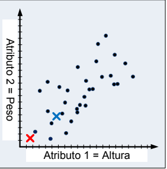
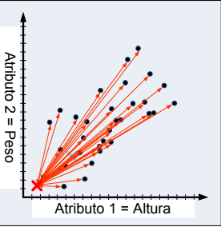
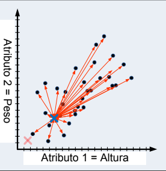
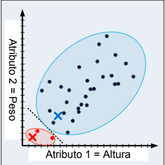
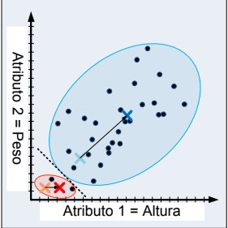
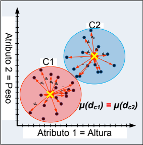

# Reconhecimento de Padrões e Aprendizado de Máquina
## Sumário
## 1. Objetivo
Este documento apresenta conceitos fundamentais sobre a segmentação de imagens através de técnicas de reconhecimento de padrões e aprendizado de máquina, com foco nos métodos **K-Means** e **Fuzzy Clustering**.
## 2. Segmentação
Processo de separar uma imagem em partes (manualmente, semiautomática ou automática) com base em informações como intensidade, cor, textura ou bordas.

Atributos fundamentais para a segmentação:
* **Intensidade:** analise do brilho de cada pixel para identificar agrupamentos.
* **Região (Conectividade):** foca na similaridade entre pixels vizinhos.
* **Borda:** baseia-se na detecção de mudanças bruscas de intensidade na imagem.
### 2.1) Processamento de informações
Para que o computador consiga realizar a segmentação automaticamente, essas informações são transformadas em **atributos**.

1) **Vetor de atributos:** cada pixel ou cada pequena região da imagem é representada por um **vetor** que combina atributos escolhidos, como intensidade, gradiente , contraste, morfologia e densidade do objeto.
2) **Espaço de atribuitos:** domínio matemático onde esses vetores são posicionados. Atributos semelhantes tendem a ficar próximos uns dos outros nesse espaço.

## 3. Métodos de agrupamento (clustering)
São **técnicas de aprendizado** que têm como objetivo  organizar dados em grupos (clusters) baseados na sua semelhança.

### 3.1) K-Means Clustering
Este algoritmo funciona de forma iterativa para dividir os pixels da imagem em k grupos distintos.
* **Como funciona:**
1. **Escolha de grupos:** quantos grupos deseja-se (ex: separar uma populção de uma sala em pessoas magras, obesas e em forma -> 3 grupos - cada ''x'' é um grupo - são os centroides iniciais).




2. **Distância dos vetores com  cada centroide**







3. **Baseado na menor distância, cada vetor é atribuído a um centroide.**



4. **Computar o novo centro de massa de cada agrupamento e reposicionar cada centroide.** 



5. Este loop acontece enquanto as **médias das distâncias entre os vetores com o centro de massa de cada cluster não forem similares.**



### Como usar o K-means para segmentação?
Os atributos podem ser:
* Intensidade;
* Localização;
* Valores de transformações;

### 3.2) Método Fuzzy C-Means (FCM)
É uma evolução do K-Means que utiliza a lógica difusa (Fuzzy). Enquanto no K-Means um pixel pertence obrigatoriamente a **apenas** um grupo, no FCM um pixel pode pertencer a vários grupos simultaneamente.
#### 3.2.1) Conjunto Crisp e Fuzzy
* **Conjunto Crisp:** lógica binária. Ou um pixel "é tecido saudável" ou é "tumor". Não há meio-termo.
* **Conjunto Fuzzy:** permite graus de pertinência (valores entre 0 e 1). Um pixel pode ter 0.8 (80%) de pertinência ao grupo "tumor" e 0.2 (20%) ao grupo "tecido saudável".

## Bibliotecas
### 1. Pandas
Ferramenta importante para manipulação e análise de dados em Python. 
#### Estruturas principais
* **DataFrame:** tabela de dados com linhas e colunas.
* **Series:** é uma única coluna desta tabela. Uma lista de dados.
#### O que fazer com esta biblioteca?
* **Carregar dados:** ler arquivos( pd.read_csv, pd.read_excel, pd.read_sql ).
* **Limpeza:** remover linhas vazias, preencher dados faltantes, renomear dados bagunçados.
* **Filtros:** ex: me mostre apenas os pacientes acima dos 50 anos de idade e com pressão alta.
* **Estatística:** calcular a média, mediana, desvio padrão.
#### 1.1) iloc
Utilizado para selecionar dados (índices de 0 até o tamanho da tabela -1).
* **Sintaxe**
```
valor = variavel.iloc[linhas, colunas]
```
### 2. Numpy
2.1) np.column_stack

Essa função é uma ferramenta muito prática para colocar arrays horizontalmente. 
```
import numpy as np

# Criando dois arrays simples 
Int_1 = np.array([1, 2, 3])
Int_2 = np.array([4, 5, 6])

# Empilhando como colunas
resultado = np.column_stack((Int_1, Int_2))

print(resultado)
# Saída:
# [[1 4]
#  [2 5]
#  [3 6]]
```


